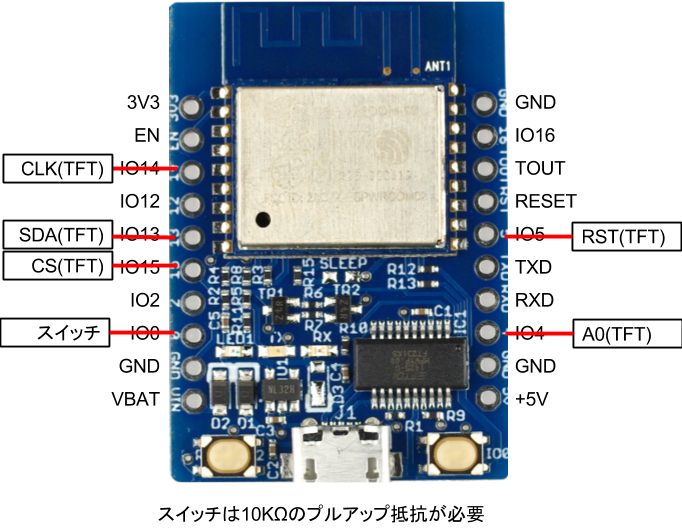

# smartoco

## 説明
ESP8266と1.8inch TFTを組み合わせたカウントダウンタイマー。  
ESP8266の基板上にあるPUSHスイッチでカウントダウンを一時停止できます。  
TFTは参考サイトに習って修正が必要です。  

  
*Youtbe*  

## 配線図

### 部品
[ESPr Developer（ESP-WROOM-02開発ボード）](https://www.switch-science.com/catalog/2500/)  
[TFT液晶with基板 [M-Z18SPI-2P]](http://www.aitendo.com/product/11590)  

### 参考サイト
[参考サイト:ESP8266にカラーTFT液晶をSPI接続してみる](http://blog.boochow.com/article/425389092.html)  
